# Platform 与 SvcKit Media 分层设计

## 1. 设计结论

Platform 是面向实现者的硬件 SPI；SvcKit Media 是面向 Application、Protocol
和其他 Service 的媒体 API。SvcKit 只能依赖 Platform 公共接口，不能直接调用
Rockchip、Allwinner 等厂商 SDK。

```text
Application / RTSP / GB28181 / Recorder / Analytics
                         │
                         ▼
                    SvcKit Media
 MediaPipeline / Source / Codec / Filter / Sink / Muxer
                         │
                         ▼
          Platform Camera / Codec / Audio / Display SPI
                         │
              ┌──────────┴──────────┐
              ▼                     ▼
           host_x86          rockchip/rv1126b
  V4L2 + x264 + PCM       VI + VENC + AI + RKAIQ
```

## 2. 职责边界

### Platform

- 屏蔽 V4L2、Rockit、RKAIQ、MPI 等厂商机制；
- 提供设备发现、能力查询、格式协商和硬件控制；
- 管理 SoC 资源、dma-buf 和厂商 buffer；
- 将厂商错误映射为统一负 errno；
- 可提供硬件 link/bind 能力，但不得包含产品业务策略。

### SvcKit Media

- 将 Camera、Codec、Display 组合为产品级媒体管线；
- 管理主码流、子码流、抓拍、录像、预览等生命周期；
- 负责线程切换、队列、背压、buffer pool、统计和异常恢复；
- 给协议和业务提供 `VideoSource`、`EncodedStream` 等稳定对象；
- 根据 Platform 能力选择硬件直连或软件回退。

SvcKit Media 内部采用节点模型：

```text
VideoSource → VideoFilter* → VideoEncoder → VideoPacketSink*
AudioSource → AudioFilter* → AudioEncoder → AudioPacketSink*
                                  └──────→ MediaMuxer
```

`MediaPipeline` 只编排节点，不直接持有 HAL device。Platform-backed Source/Codec
节点是唯一允许调用 Platform SPI 的 SvcKit 实现；协议层只能实现或消费 Sink。

### Application 与 Protocol

- 只依赖 SvcKit Media；
- 不调用 `hw_get_module()`，不持有 HAL device；
- 不出现 `RK_MPI_*`、`MB_BLK` 或 SoC 通道编号。

## 3. Camera 与 Codec

Camera SPI 只负责 Sensor/ISP/VI 与原始帧，不负责预览、编码、RTSP 或录像。
Codec SPI 只负责硬件/软件编解码。因此原 Platform `media/ICodec.h` 收窄并更名为
`codec/ICodec.h`，把 Media 这个概念留给 SvcKit。

Camera 现有 `preview_start/preview_stop` 属于历史耦合。迁移顺序为：

1. SvcKit Media 建立 Camera→Display 组合；
2. Platform 增加通用硬件 link 能力；
3. Rockchip link 实现映射到 `RK_MPI_SYS_Bind`；
4. 删除 Camera preview ops 和其 vendor 实现。

在第 2 步完成前不直接删除现有预览实现，避免功能回退。

## 4. 硬件直连

SvcKit 不得为了性能穿透到 MPI。后续由 Platform 暴露通用连接接口：

```text
media_link_create(camera output, codec input)
media_link_start(link)
media_link_stop(link)
media_link_destroy(link)
```

Rockchip 可以实现为 `RK_MPI_SYS_Bind`，host 实现为 callback + queue。SvcKit 只选择
能力，不知道具体实现。

## 5. Buffer 契约

当前 Camera/Codec buffer 仅足够支撑同步回调。下一版本公共 buffer 必须明确：

- `capacity` 与 `bytes_used` 分离；
- 多 plane 的 fd、offset、stride、size；
- buffer 所有权和 acquire/release；
- callback 返回后的有效期；
- acquire/release fence 和 cache coherency；
- `struct_size`，保证 minor 版本结构扩展安全。

在统一 buffer 落地前，SvcKit Media 的 `EncodedPacketView` 只在回调期间有效，异步
消费者必须复制到自己的 BufferPool。

## 6. 依赖规则

允许：

```text
SvcKit Media → Platform public SPI
Platform vendor implementation → vendor SDK
Protocol → SvcKit Media
```

禁止：

```text
SvcKit Media → vendor SDK
Protocol/Application → Platform vendor implementation
Platform → SvcKit
```

CI 后续应增加 include 扫描，阻止 `SvcKit/` 出现厂商 SDK 头文件或 `RK_MPI_` 符号。

```mermaid
sequenceDiagram
    autonumber

    box Application 应用层
        participant App as generic_ipc / Protocol
    end

    box SvcKit Media 框架层
        participant Pipe as MediaPipeline
        participant Factory as MediaFactory
        participant VSource as VideoSource
        participant VEncoder as VideoEncoder
        participant ASource as AudioSource
    end

    box Platform / SoC 适配层
        participant SPI as Platform SPI
        participant HAL as host_x86 / RV1126B HAL
    end

    %% ================================================================
    %% 创建与格式协商
    %% ================================================================

    App->>Pipe: createMediaPipeline(config, videoCb, audioCb)
    activate Pipe

    Pipe->>Factory: createPlatformVideoSource(captureConfig)
    activate Factory
    Factory->>SPI: hw_get_module("camera")
    SPI->>HAL: module.open(cameraId)
    HAL-->>SPI: camera_device_t
    Factory->>SPI: camera.set_format(requestedFormat)
    SPI->>HAL: V4L2 / RK_MPI_VI 配置
    HAL-->>Factory: 实际 width / height / fps / pixelFormat
    Factory-->>Pipe: VideoSource
    deactivate Factory

    Pipe->>Factory: createPlatformVideoEncoder(encoderConfig, actualFormat)
    activate Factory
    Factory->>SPI: hw_get_module("codec")
    SPI->>HAL: module.open(codecId)
    HAL-->>SPI: codec_device_t
    Factory->>SPI: codec.set_format(H264/H265, actualFormat)
    SPI->>HAL: x264 / RK_MPI_VENC 配置
    Factory-->>Pipe: VideoEncoder
    deactivate Factory

    Pipe->>Factory: createPlatformAudioSource(audioConfig)
    activate Factory
    Factory->>SPI: hw_get_module("audio")
    SPI->>HAL: module.open("audio")
    HAL-->>SPI: audio_device_t
    Factory->>SPI: audio.set_format(INPUT, PCM format)
    SPI->>HAL: ALSA / RK_MPI_AI 配置
    HAL-->>Factory: 实际 sampleRate / channels
    Factory-->>Pipe: AudioSource
    deactivate Factory

    Pipe-->>App: unique_ptr<MediaPipeline>
    deactivate Pipe

    %% ================================================================
    %% 启动
    %% ================================================================

    App->>Pipe: start()
    activate Pipe

    Pipe->>VEncoder: start()
    VEncoder->>SPI: codec.ops.start()
    SPI->>HAL: x264_encoder_open / RK_MPI_VENC_StartRecvFrame
    HAL-->>VEncoder: 0

    Pipe->>ASource: start(audioFrameHandler)
    ASource->>SPI: audio.ops.start(INPUT)
    SPI->>HAL: 启动 PCM 采集
    HAL-->>ASource: 0
    ASource->>ASource: 创建 Audio Reader Thread

    Pipe->>VSource: start(videoFrameHandler)
    VSource->>SPI: camera.set_frame_callback()
    VSource->>SPI: camera.ops.start()
    SPI->>HAL: 启动 Camera / VI
    HAL-->>VSource: 0

    Pipe-->>App: start() = 0
    deactivate Pipe

    Note over Pipe,HAL: 启动顺序：Encoder → AudioSource → VideoSource
    Note over Pipe,HAL: 任一步失败时，按相反顺序停止已经启动的节点

    %% ================================================================
    %% 音视频并行数据流
    %% ================================================================

    par 视频采集和编码线程
        loop 每个 Camera Frame
            HAL-->>VSource: camera_frame_cb(camera_frame_t)
            activate VSource

            VSource->>VSource: 转换为 VideoFrameView
            VSource-->>Pipe: videoFrameHandler(VideoFrameView)
            activate Pipe

            Pipe->>VEncoder: encode(VideoFrameView)
            activate VEncoder

            VEncoder->>SPI: codec.ops.encode(input, output)
            SPI->>HAL: x264 / RK_MPI_VENC 编码
            HAL-->>SPI: H.264 / H.265 packet
            SPI-->>VEncoder: codec_buffer_t
            VEncoder-->>Pipe: EncodedPacketView

            deactivate VEncoder

            Pipe-->>App: videoCallback(EncodedPacketView)
            deactivate Pipe
            deactivate VSource
        end

    and PCM 音频采集线程
        loop Audio Reader Thread
            ASource->>SPI: audio.ops.read(buffer, timeout)
            SPI->>HAL: ALSA read / RK_MPI_AI_GetFrame
            HAL-->>SPI: PCM + timestamp

            alt HAL 返回 -ENOSPC
                SPI-->>ASource: required buffer size
                ASource->>ASource: 扩大读取缓冲区
            else PCM 读取成功
                SPI-->>ASource: audio_buffer_t
                ASource->>ASource: 按 framesPerBuffer 重新分块
                ASource-->>Pipe: AudioFrameView
                Pipe-->>App: audioCallback(AudioFrameView)
            end
        end
    end

    Note over App,Pipe: EncodedPacketView 和 AudioFrameView 只在当前回调期间有效
    Note over App,Pipe: RTSP、录像等异步消费者必须复制或转入 BufferPool

    %% ================================================================
    %% 可选音频编码节点
    %% ================================================================

    opt Application/Protocol 需要编码音频
        App->>Factory: createAudioEncoder(G711A/G711U)
        Factory-->>App: AudioEncoder
        App->>ASource: 消费 AudioFrameView
        ASource-->>App: S16LE PCM
        App->>App: AudioEncoder.encode(PCM)
        App->>App: EncodedAudioPacketView → RTSP / Recorder
    end

    %% ================================================================
    %% 停止与回收
    %% ================================================================

    App->>Pipe: stop()
    activate Pipe

    Pipe->>VSource: stop()
    VSource->>SPI: camera.ops.stop()
    SPI->>HAL: 停止 Camera / VI
    VSource->>SPI: clear frame callback
    VSource-->>Pipe: 0

    Pipe->>ASource: stop()
    ASource->>ASource: running = false
    ASource->>ASource: join Audio Reader Thread
    ASource->>SPI: audio.ops.stop(INPUT)
    SPI->>HAL: 停止 ALSA / RK_MPI_AI
    ASource-->>Pipe: 0

    Pipe->>VEncoder: stop()
    VEncoder->>SPI: codec.ops.stop()
    SPI->>HAL: x264_encoder_close / RK_MPI_VENC_StopRecvFrame
    VEncoder-->>Pipe: 0

    Pipe-->>App: stop() = 0
    deactivate Pipe

    Note over App,HAL: stop() 返回后，不再产生任何音视频回调
```


