# Platform 与 SvcKit Media 分层设计

## 1. 设计结论

Platform 是面向实现者的硬件 SPI；SvcKit Media 是面向 Application、Protocol
和其他 Service 的媒体 API。SvcKit 只能依赖 Platform 公共接口，不能直接调用
Rockchip、Allwinner 等厂商 SDK。

```text
Application / RTSP / GB28181 / Recorder / Analytics
                         │
                         ▼
                    SvcKit Media
       Pipeline / Source / Codec / Filter / Sink / Muxer
                         │
                         ▼
          Platform Camera / Codec / Audio / Display SPI
                         │
              ┌──────────┴──────────┐
              ▼                     ▼
           host_x86          rockchip/rv1126b
       V4L2 + x264 + ALSA    VI + VENC + AI + RKAIQ
```

## 2. 职责边界

Platform：

- 屏蔽 V4L2、Rockit、RKAIQ、MPI 等厂商机制；
- 提供设备发现、能力查询、格式协商和硬件控制；
- 管理 SoC 资源、dma-buf 和厂商 buffer；
- 将厂商错误映射为统一负 errno；
- 可提供硬件 link/bind 能力，但不包含产品业务策略。

SvcKit Media：

- 将 Camera、Codec、Audio、Display 组合为产品级管线；
- 管理主辅码流、抓拍、录像和预览的生命周期；
- 负责线程切换、有界队列、背压、Fanout、统计和异常事件；
- 根据 Platform 能力选择硬件直连或 CPU buffer 回退。

Application 与 Protocol 只依赖 SvcKit Media，不持有 HAL device，不出现
`RK_MPI_*`、`MB_BLK` 或 SoC 通道编号。

## 3. 节点和数据所有权

```text
VideoSource → VideoQueue → VideoEncoder → VideoFanout → VideoPacketSink*
AudioSource → AudioQueue → AudioEncoder → AudioFanout → AudioPacketSink*
```

`MediaBuffer` 是不可变、有所有权的数据对象。Frame/Packet 使用 `shared_ptr` 持有它，
最后一个消费者释放后自动回收，因此异步 Sink 不再依赖回调栈上的临时 view。

采集回调只做以下工作：

1. 将 Platform buffer 转成 owned `MediaBuffer`；
2. 携带 `CLOCK_MONOTONIC` 纳秒时间戳构造 Frame；
3. 非阻塞写入有界输入队列。

编码由独立工作线程完成。Fanout 为每个 Sink 建立独立有界队列和消费线程；队列满时
按 `DropOldest` 或 `DropNewest` 执行，不反压 Camera/Audio 实时线程。自检使用
无回调 Probe Sink；业务组件通过实现 Sink 接口接收数据。

## 4. 生命周期和控制面

管线状态为：

```text
Created → Starting → Running ↔ Degraded → Stopping → Stopped
                    └───────────────→ Failed
```

启动顺序是 Codec、Fanout/Workers、AudioSource、VideoSource；失败和停止按相反方向
清理。错误、丢帧和状态变化写入内部事件队列，由 Application 使用 `waitEvent()`
拉取，避免错误回调在数据线程中重入 `start()`/`stop()`。`stats()` 提供累计计数。

## 5. Camera、Codec 与硬件直连

Camera SPI 只负责 Sensor/ISP/VI 与原始帧，Codec SPI 只负责编解码。原 Platform
`media/ICodec.h` 已收窄为 `codec/ICodec.h`，把 Media 概念留给 SvcKit。

SvcKit 不得为了性能穿透到 MPI。后续由 Platform 提供通用连接能力：

```text
media_link_create(camera output, codec input)
media_link_start(link)
media_link_stop(link)
media_link_destroy(link)
```

Rockchip 可映射到 `RK_MPI_SYS_Bind`，host 可映射到 queue，SvcKit 只做能力选择。
当前 owned CPU buffer 路径保证功能和生命周期正确，硬件 link 是不改变上层 API 的
优化路径。

## 6. 依赖规则

允许：

```text
SvcKit Media → Platform public SPI
Platform vendor implementation → vendor SDK
Protocol/Application → SvcKit Media
```

禁止：

```text
SvcKit Media → vendor SDK
Protocol/Application → Platform vendor implementation
Platform → SvcKit
```

## 7. 接口交互序列

```mermaid
sequenceDiagram
    autonumber

    box Application 应用与协议层
        participant App as generic_ipc / Protocol
        participant RTSP as RTSP Sink
        participant Recorder as Recorder Sink
        participant Analytics as Analytics Sink
    end

    box SvcKit Media 框架层
        participant API as Media API
        participant Pipe as MediaPipeline
        participant EventQ as Event Queue
        participant VQ as Video Input Queue
        participant VE as Video Encoder Worker
        participant VFan as Video Fanout
        participant AQ as Audio Input Queue
        participant AE as Audio Encoder Worker
        participant AFan as Audio Fanout
    end

    box Platform SoC 适配层
        participant VSource as PlatformVideoSource
        participant VCodec as PlatformVideoEncoder
        participant ASource as PlatformAudioSource
        participant SPI as Camera / Codec / Audio SPI
        participant HAL as host_x86 / RV1126B HAL
    end

    %% ================================================================
    %% 创建和设备协商
    %% ================================================================

    App->>API: createMediaPipeline(config)
    activate API

    API->>VSource: create(captureConfig)
    VSource->>SPI: open camera + set/get format
    SPI->>HAL: V4L2 / RK_MPI_VI
    HAL-->>VSource: negotiated video format

    API->>VCodec: create(encoderConfig, videoFormat)
    VCodec->>SPI: open codec + set format
    SPI->>HAL: x264 / RK_MPI_VENC
    HAL-->>VCodec: configured encoder

    API->>ASource: create(audioCaptureConfig)
    ASource->>SPI: open audio + set/get format
    SPI->>HAL: ALSA / RK_MPI_AI
    HAL-->>ASource: negotiated audio format

    API->>AE: createAudioEncoder(audioEncoderConfig)
    Note over AE: PCM / G711A / G711U

    API->>Pipe: assemble and own all nodes
    API-->>App: unique_ptr<MediaPipeline>
    deactivate API

    %% ================================================================
    %% 注册多个异步消费者
    %% ================================================================

    App->>Pipe: addVideoSink(RTSP, queueConfig)
    Pipe->>VFan: create dedicated queue + worker

    App->>Pipe: addVideoSink(Recorder, queueConfig)
    Pipe->>VFan: create dedicated queue + worker

    App->>Pipe: addVideoSink(Analytics, queueConfig)
    Pipe->>VFan: create dedicated queue + worker

    App->>Pipe: addAudioSink(RTSP, queueConfig)
    Pipe->>AFan: create dedicated queue + worker

    App->>Pipe: addAudioSink(Recorder, queueConfig)
    Pipe->>AFan: create dedicated queue + worker

    %% ================================================================
    %% 启动
    %% ================================================================

    App->>Pipe: start()
    activate Pipe

    Pipe->>EventQ: StateChanged(Starting)

    Pipe->>VCodec: start()
    VCodec->>SPI: codec.start()
    SPI->>HAL: start x264 / VENC

    Pipe->>AE: start()

    Pipe->>VFan: start all sink workers
    VFan->>RTSP: start()
    VFan->>Recorder: start()
    VFan->>Analytics: start()

    Pipe->>AFan: start all sink workers
    AFan->>RTSP: start()
    AFan->>Recorder: start()

    Pipe->>VE: start video encoding worker
    Pipe->>AE: start audio encoding worker

    Pipe->>ASource: start(frameHandler, errorHandler)
    ASource->>SPI: audio.start(INPUT)
    SPI->>HAL: start microphone capture

    Pipe->>VSource: start(frameHandler, errorHandler)
    VSource->>SPI: camera.start()
    SPI->>HAL: start Camera / VI

    Pipe->>EventQ: StateChanged(Running)
    Pipe-->>App: start() = 0
    deactivate Pipe

    %% ================================================================
    %% 音视频异步数据面
    %% ================================================================

    par Video pipeline
        loop each camera frame
            HAL-->>VSource: camera_frame_t + monotonic timestamp
            activate VSource
            VSource->>VSource: copy into immutable MediaBuffer
            VSource->>VQ: enqueue VideoFramePtr
            Note over VSource,VQ: Source 回调只做数据转换和非阻塞入队
            deactivate VSource

            VQ-->>VE: dequeue VideoFramePtr
            activate VE
            VE->>VCodec: encode(VideoFrame)
            VCodec->>SPI: codec.encode(input, output)
            SPI->>HAL: x264 / RK_MPI_VENC encode
            HAL-->>VCodec: encoded bytes + keyframe flag
            VCodec-->>VE: owned VideoPacketPtr
            VE->>VFan: dispatch(shared VideoPacketPtr)
            deactivate VE

            par Independent video sinks
                VFan-->>RTSP: queue → consume(VideoPacketPtr)
            and
                VFan-->>Recorder: queue → consume(VideoPacketPtr)
            and
                VFan-->>Analytics: queue → consume(VideoPacketPtr)
            end

            Note over VFan,Analytics: Sink 共享不可变 MediaBuffer<br/>最后一个消费者释放后自动回收
        end

    and Audio pipeline
        loop each PCM block
            ASource->>SPI: audio.read(timeout)
            SPI->>HAL: ALSA / RK_MPI_AI read
            HAL-->>ASource: PCM + monotonic timestamp

            alt HAL returns required buffer size
                ASource->>ASource: grow read buffer
            else PCM available
                ASource->>ASource: reblock by framesPerBuffer
                ASource->>ASource: copy into immutable MediaBuffer
                ASource->>AQ: enqueue AudioFramePtr
            end

            AQ-->>AE: dequeue AudioFramePtr
            activate AE
            AE->>AE: PCM / G711A / G711U encode
            AE->>AFan: dispatch(shared AudioPacketPtr)
            deactivate AE

            par Independent audio sinks
                AFan-->>RTSP: queue → consume(AudioPacketPtr)
            and
                AFan-->>Recorder: queue → consume(AudioPacketPtr)
            end
        end
    end

    %% ================================================================
    %% 背压、错误和控制面
    %% ================================================================

    alt Input queue is full
        VQ->>VQ: DropOldest or DropNewest
        VQ->>Pipe: increment droppedVideoFrames
        Pipe->>EventQ: VideoFrameDropped
    else Sink queue is full
        VFan->>VFan: drop only for the slow sink
        VFan->>Pipe: increment sinkErrors
        Pipe->>EventQ: SinkError
    else Source or Encoder fails
        VE->>Pipe: encode/source error
        Pipe->>EventQ: error event
    end

    opt First runtime error
        Pipe->>Pipe: state = Degraded
        Pipe->>EventQ: StateChanged(Degraded)
    end

    App->>Pipe: waitEvent(timeout)
    Pipe->>EventQ: dequeue event
    EventQ-->>Pipe: MediaEvent
    Pipe-->>App: state / drop / error event

    App->>Pipe: stats()
    Pipe-->>App: PipelineStats snapshot

    %% ================================================================
    %% 停止和回收
    %% ================================================================

    App->>Pipe: stop()
    activate Pipe

    Pipe->>EventQ: StateChanged(Stopping)

    Pipe->>VSource: stop()
    VSource->>SPI: camera.stop()
    SPI->>HAL: stop Camera / VI
    VSource->>SPI: clear frame callback

    Pipe->>ASource: stop()
    ASource->>ASource: stop + join reader thread
    ASource->>SPI: audio.stop(INPUT)
    SPI->>HAL: stop microphone capture

    Pipe->>VQ: close queue
    Pipe->>AQ: close queue
    Pipe->>VE: drain and join worker
    Pipe->>AE: drain and join worker

    Pipe->>VCodec: stop()
    VCodec->>SPI: codec.stop()
    SPI->>HAL: stop x264 / VENC

    Pipe->>AE: stop()

    Pipe->>VFan: drain queues + join sink workers
    VFan->>RTSP: stop()
    VFan->>Recorder: stop()
    VFan->>Analytics: stop()

    Pipe->>AFan: drain queues + join sink workers
    AFan->>RTSP: stop()
    AFan->>Recorder: stop()

    Pipe->>EventQ: StateChanged(Stopped)
    Pipe-->>App: stop() = 0
    deactivate Pipe

    Note over App,HAL: stop() 返回后，采集、编码和 Sink 工作线程均已退出
```




Sensor RAW
 → ISP
 → NV12
 → 复制到 VideoFrame
 → 有界队列
 → H.264/H.265 编码
 → 复制到 VideoPacket
 → shared_ptr 无 payload 复制分发
 → Sink